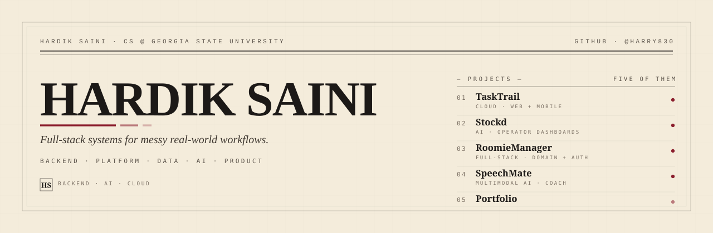

<!--
  Hardik Saini — GitHub profile README
  Visual direction: engineering monograph, editorial,
  warm paper / deep ink / oxblood-ember.
-->

<picture>
  <source media="(prefers-color-scheme: dark)" srcset="assets/masthead-dark.svg">
  <source media="(prefers-color-scheme: light)" srcset="assets/masthead-light.svg">
  
</picture>

&nbsp;

`BACKEND` &nbsp; `PLATFORM` &nbsp; `DATA` &nbsp; `AI` &nbsp; `PRODUCT` &nbsp; `MOBILE`

&nbsp;

> **I design and ship full systems** — the API boundary, the data model, the auth story, the deploy pipeline, and the surface a real person actually uses. The work spans backend and platform, AI product workflows, and a polished user experience that holds up under inspection.

&nbsp;

---

§ &nbsp; **FEATURED SYSTEMS** &nbsp; · &nbsp; FIVE ENTRIES &nbsp; · &nbsp; 001 → 005

## TaskTrail &nbsp;`01 · CLOUD · WEB + MOBILE`

> Role-aware coordination for small teams. Managers create teams, generate join access, assign one-off or recurring work, and monitor execution; employees join, pick up assigned work, update progress, and complete tasks. **Web and mobile share one API contract.**

|     |     |
| :-- | :-- |
| **Why it matters** | Small teams need real coordination, not group chats. Ownership and execution stay legible. |
| **Signal** | cloud delivery · RBAC · backend architecture · shared API contract across web and mobile |
| **Stack** | `Node.js` `Express` `Supabase Auth` `Postgres` `Zod` `Docker` `OCI VM` `Caddy` `Vercel` `GitHub Actions` `GHCR` `Flutter` `Dart` `Dio` `GoRouter` |
| **Live** | [tasktrail.site](https://tasktrail.site) &nbsp;·&nbsp; [api health](https://api.tasktrail.site/api/v1/health) |
| **Source** | [web](https://github.com/blank-space-gsu/TaskTrail) &nbsp;·&nbsp; [mobile](https://github.com/Harry830/tasktrail-mobile) |

 

## Stockd &nbsp;`02 · AI · OPERATOR DASHBOARDS`

> An operator-facing product covering **restaurant inventory workflows, forecasting, pricing, and operator dashboards**, with an AI copilot, security monitoring, and a Supabase-backed product surface.

|     |     |
| :-- | :-- |
| **Why it matters** | Inventory is where margin lives. The system puts forecasting, pricing, and visibility on one surface. |
| **Signal** | AI/product thinking · operational dashboards · Supabase-backed product surface · security monitoring |
| **Stack** | `JavaScript` `HTML/CSS` `Chart.js` `Supabase` `PostgreSQL functions` `Edge Functions` `OpenAI` `Jest` `GitHub Actions` |
| **Live** | [stockd.us](https://www.stockd.us) |
| **Source** | [stockd-ai/Stockd](https://github.com/stockd-ai/Stockd) |

 

## RoomieManager &nbsp;`03 · FULL-STACK · DOMAIN + AUTH`

> A household management platform covering groups, chores, finance, and contracts, with a **Supabase auth boundary, RBAC, OpenAPI docs, structured logs, and tests.**

|     |     |
| :-- | :-- |
| **Why it matters** | Shared-living rules are usually soft contracts. This makes them explicit, auditable, and fair. |
| **Signal** | full-stack systems · domain modeling · auth boundary · verification pipeline |
| **Stack** | `React 18` `TypeScript` `Vite` `Tailwind` `React Router` `NestJS 10` `Prisma 5` `Supabase` `jose / JWKS` `Swagger / OpenAPI` `Pino` `Jest` `e2e` |
| **Live** | [roomiemanager.site](https://roomiemanager.site) &nbsp;·&nbsp; [api docs](https://api.roomiemanager.site/api/docs) |
| **Source** | [GSU-BitByBit/RoomieManager](https://github.com/GSU-BitByBit/RoomieManager) |

 

## SpeechMate &nbsp;`04 · MULTIMODAL AI · COACH`

> AI public speaking coach. Speech outline generation, **multimodal video and document analysis,** detailed feedback, an improvement plan, curated YouTube recommendations, and ElevenLabs text-to-speech practice — fronted by Google OAuth.

|     |     |
| :-- | :-- |
| **Why it matters** | Speaking well is high-leverage and hard to practice. The coach turns a vague skill into a tractable feedback loop. |
| **Signal** | multimodal AI · full-stack Java/React · OAuth · voice and audio workflow |
| **Stack** | `Java 21` `Spring Boot 3.5.7` `Spring Security OAuth2` `WebFlux / WebClient` `React 19` `TypeScript` `Vite` `React Router` `Axios` `Framer Motion` `Gemini 2.5 Pro / 2.0 Flash` `ElevenLabs` |
| **Source** | [TheGSUCoders/SpeechMate](https://github.com/TheGSUCoders/SpeechMate) |

 

## Portfolio &nbsp;`05 · BRAND · FRONTEND CRAFT`

> A personal portfolio and brand system: **editorial, performant, written in a current React stack.** The front door to the rest of the work.

|     |     |
| :-- | :-- |
| **Why it matters** | The brand hub. The bar set here sets the bar for the rest of the work. |
| **Signal** | frontend craft · product taste · personal brand system |
| **Stack** | `Next.js 16` `React 19` `Tailwind CSS v4` `Framer Motion 12` `EmailJS` `Nodemailer` `Vercel Analytics` |
| **Live** | [harry830.tech](https://www.harry830.tech) &nbsp;·&nbsp; [about](https://www.harry830.tech/about) |
| **Source** | [Harry830/portfolio](https://github.com/Harry830/portfolio) |

---

§ &nbsp; **FIELD KIT** &nbsp; · &nbsp; THE CURRENT WORKING SET

## Field Kit

`a` &nbsp; FRONTEND &nbsp;·&nbsp; SURFACE &amp; INTERACTION

`React 18 / 19` &nbsp; `Next.js 16` &nbsp; `TypeScript` &nbsp; `Vite` &nbsp; `Tailwind v4` &nbsp; `Framer Motion` &nbsp; `React Router` &nbsp; `Chart.js`

`b` &nbsp; BACKEND &amp; API &nbsp;·&nbsp; SERVICES &amp; CONTRACTS

`Node.js` &nbsp; `Express` &nbsp; `NestJS 10` &nbsp; `Spring Boot 3.5` &nbsp; `Spring WebFlux` &nbsp; `Zod` &nbsp; `OpenAPI / Swagger`

`c` &nbsp; MOBILE &nbsp;·&nbsp; CROSS-PLATFORM CLIENTS

`Flutter` &nbsp; `Dart` &nbsp; `Dio` &nbsp; `GoRouter` &nbsp; `flutter_secure_storage`

`d` &nbsp; DATA, AUTH &amp; INFRA &nbsp;·&nbsp; THE BOUNDARY LAYER

`Supabase Postgres` &nbsp; `Supabase Auth` &nbsp; `Prisma 5` &nbsp; `PostgreSQL functions` &nbsp; `Edge Functions` &nbsp; `jose / JWKS` &nbsp; `Spring Security OAuth2` &nbsp; `Pino` &nbsp; `Docker` &nbsp; `OCI VM` &nbsp; `Caddy` &nbsp; `Vercel` &nbsp; `GitHub Actions` &nbsp; `GHCR`

`e` &nbsp; AI &amp; PRODUCT INTELLIGENCE &nbsp;·&nbsp; AI WORKFLOWS

`OpenAI` &nbsp; `Gemini 2.5 Pro / 2.0 Flash` &nbsp; `ElevenLabs`

`f` &nbsp; DELIVERY &amp; QUALITY &nbsp;·&nbsp; SHIPPING SAFELY

`Jest` &nbsp; `e2e` &nbsp; `structured logging` &nbsp; `GitHub Actions pipelines`

---

§ &nbsp; **METHOD** &nbsp; · &nbsp; HOW THE WORK GETS BUILT

## How I Build

> ### `i.` &nbsp; Systems first
>
> Before writing code, I draw the boundary: who owns the data, where auth lives, what the API contract is, and how it deploys. The rest follows from that.

> ### `ii.` &nbsp; Product taste matters
>
> A correct system that feels clumsy is unfinished. I ship surfaces I would be willing to use myself.

> ### `iii.` &nbsp; Clean handoffs
>
> Documented APIs, structured logs, tests at the seams, and reproducible deploys — so the next person, including future me, is not guessing.

---

§ &nbsp; **CONNECT** &nbsp; · &nbsp; THE FRONT DOOR

### [`harry830.tech`](https://www.harry830.tech) &nbsp;·&nbsp; [`@Harry830`](https://github.com/Harry830) &nbsp;·&nbsp; [`about`](https://www.harry830.tech/about)

 

HARDIK SAINI &nbsp;·&nbsp; ENGINEERING MONOGRAPH &nbsp;·&nbsp; FOLIO 001 / MMXXVI

